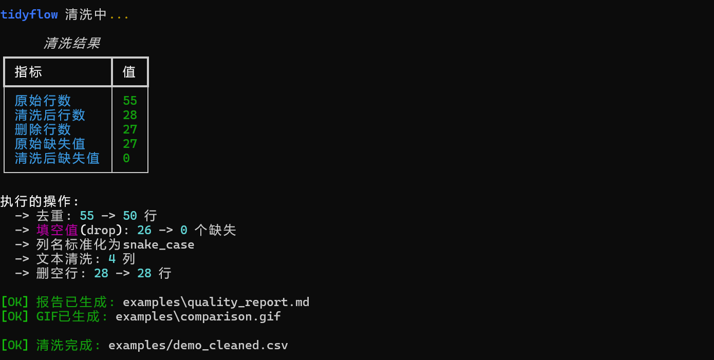
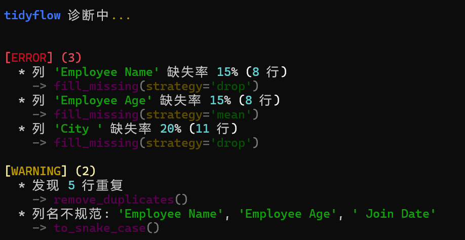
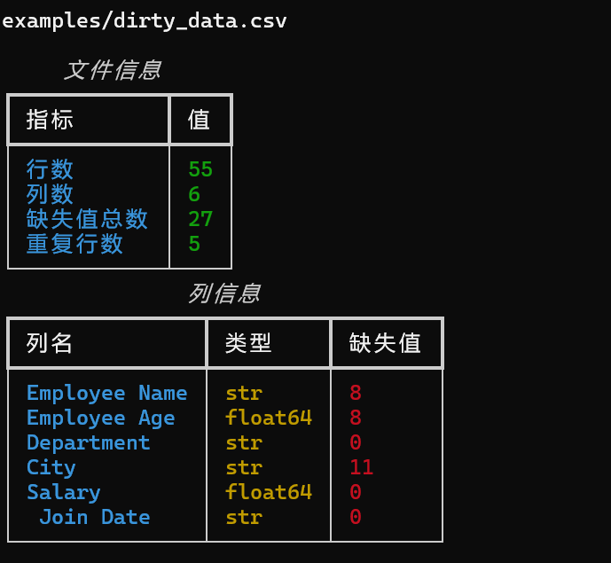
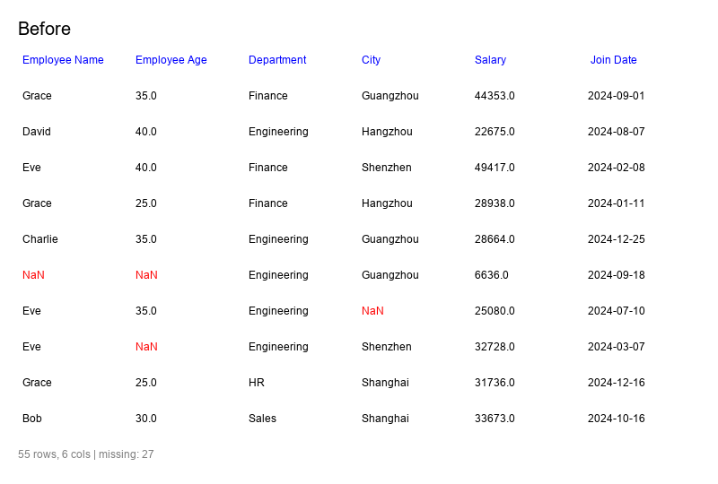

# tidyflow

[](https://www.python.org/downloads/)
[](LICENSE)

CSV/Excel/JSON 数据清洗工具。命令行或 Python API 调用，支持链式操作。

## 功能

- 去重、填空值、列名标准化、文本去空格
- 数据诊断：检测问题并给出修复建议
- 分级质量报告（warning / error / critical）
- 清洗前后对比 GIF

## 效果展示

### 清洗



### 诊断



### 文件信息



### 清洗前后对比



## 安装

```bash
git clone https://github.com/LiuliX/tidyflow.git
cd tidyflow
pip install -e .
```

## CLI

```bash
# 清洗 + 生成报告 + 对比 GIF
tidyflow clean data.csv -o cleaned.csv --report --gif

# 指定填空策略
tidyflow clean data.csv -o cleaned.csv --fill-strategy median

# 诊断数据问题
tidyflow detect data.csv
tidyflow detect data.csv --json

# 查看文件信息
tidyflow info data.csv

# 仅生成质量报告（不清洗）
tidyflow report data.csv
```

## Python API

```python
from tidyflow import Cleaner

result = (
    Cleaner("data.csv")
    .remove_duplicates()
    .fill_missing(strategy="mean")
    .to_snake_case()
    .strip_text()
    .clean()
)

result.save("cleaned.csv")
result.report("report.md")
result.to_gif("comparison.gif")
```

### 诊断

```python
from tidyflow import Diagnoser
import pandas as pd

df = pd.read_csv("data.csv")
report = Diagnoser(df).diagnose()
print(report.summary())
```

## 项目结构

```
tidyflow/
├── tidyflow/
│   ├── __init__.py
│   ├── cli.py           # CLI 命令
│   ├── cleaner.py       # 清洗逻辑
│   ├── diagnoser.py     # 数据诊断
│   ├── reporter.py      # 报告生成
│   └── utils.py         # GIF 生成
├── tests/
├── examples/
├── setup.py
└── requirements.txt
```

## 依赖

- pandas >= 1.5.0
- click >= 8.0.0
- rich >= 13.0.0
- Pillow >= 9.0.0（GIF 生成）

## License

MIT
